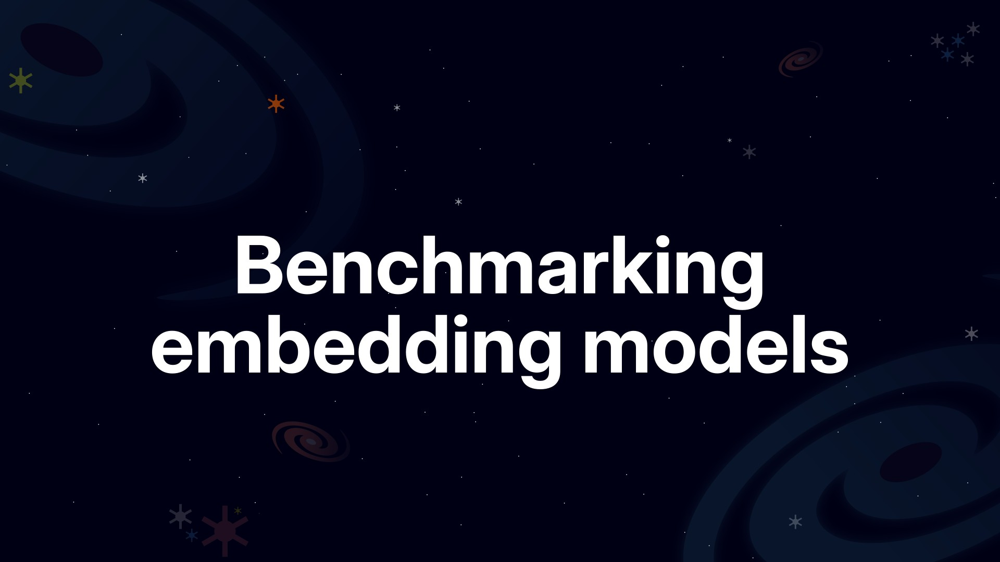
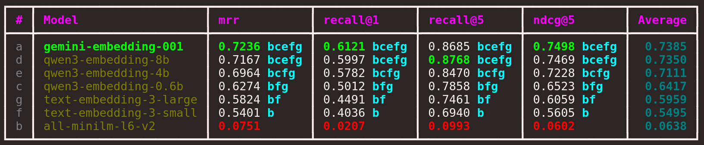
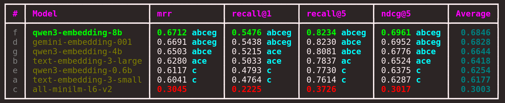
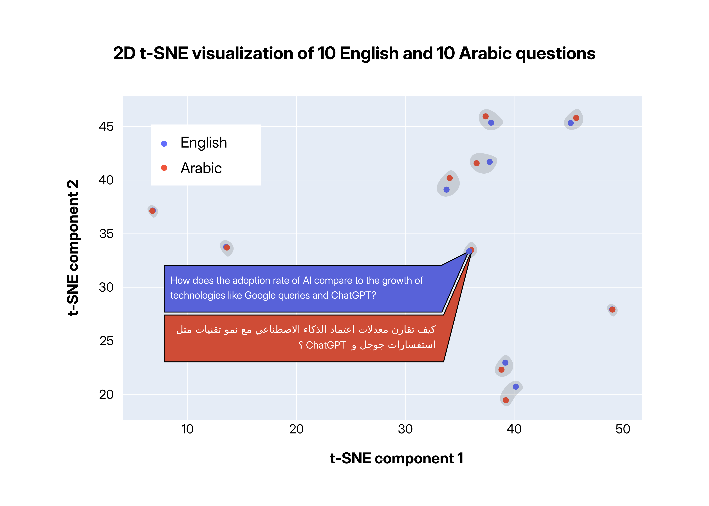
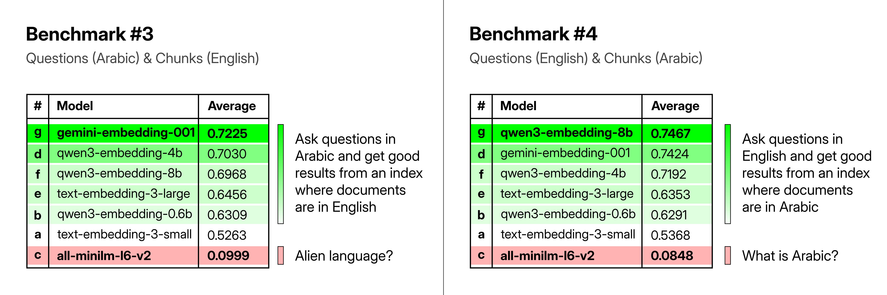

# Benchmarking embedding models



Welcome to the repository! This project is designed to help you create a high-quality (golden) dataset from your own or your company's data. After that, you will use that dataset to benchmark and compare different embedding models.

You will evaluate the models using various metrics, including [MRR](https://amenra.github.io/ranx/metrics/#mean-reciprocal-rank), [Recall@K](https://amenra.github.io/ranx/metrics/#recall), and [NDCG@K](https://amenra.github.io/ranx/metrics/#ndcg). Additionally, you will apply [statistical tests](https://en.wikipedia.org/wiki/Statistical_hypothesis_test) to determine whether the differences between models are statistically significant.

By combining these metrics and tests, you can confidently identify the best embedding model for your specific use case. The following figures show a comparison of seven models on three datasets:


*Figure 1: Comparison of seven embedding models on the english dataset.*


*Figure 2: Comparison of seven embedding models on the arabic dataset.*


*Figure 3: Comparison of seven embedding models on the merged arabic and english dataset.*

## What is in this repository?

- `notebooks/`: Jupyter notebooks for each step in the pipeline.
- `slides/`: Presentation slides used in the YouTube series.
- `data/`: Data used in the notebooks.

> [!NOTE]
> The `embedding` folder is not pushed to the repository due to its large size. I moved that data into Hugging Face, [download the files from this repository](https://huggingface.co/datasets/ImadSaddik/BenchmarkEmbeddingModelsCourse). After downloading, create an `embedding` folder inside `data/` and put the JSON files there.

## What you will learn?

The notebooks in this repository follow exactly this pipeline:


*Figure 4: Pipeline for benchmarking embedding models.*

The pipeline is structured in a way that makes it easy to follow and understand each step. You will learn the following concepts:

- The limitations of extracting text from PDF files with Python libraries and to solve that with the help of VLMs (Vision Language Models).
- How to divide the extracted text into chunks that preserve context.
- Generation questions for each chunk using LLMs (Large Language Models).
- Use embedding models to create vector representations of the chunks and questions.
- Use both open source and proprietary embedding models.
- Use [llama.cpp](https://github.com/ggml-org/llama.cpp) to run models in the GGUF format locally on your machine.
- Perform the benchmarking of different embedding models using various metrics and statistical tests with the help of [ranx](https://github.com/AmenRa/ranx).
- Plot the vector representations to visualize if clusters are being formed.
- Understand how to interpret the p-value that a statistical test provides.
- And much more!

## Setup

To get started, install [Python](https://www.python.org/downloads/) and create a virtual environment.

```bash
# Anaconda
conda create -n benchmark-embedding-models python=3.13 -y
conda activate benchmark-embedding-models

# venv
python -m venv benchmark-embedding-models
source benchmark-embedding-models/bin/activate  # On Windows use `benchmark-embedding-models\Scripts\activate`
```

Now, install the required dependencies:

```bash
pip install -r requirements.txt
```

You will also need to generate API keys to use Gemini and OpenAI models. Put the keys in a `.env` file in the root of the repository as follows:

```text
GOOGLE_API_KEY=""
OPENAI_API_KEY=""
```

If you prefer not to work with closed-source models, there are notebooks available that rely exclusively on open-source models.

## Surprising findings

### Universal semantic space

I have discovered that multilingual (trained on multiple languages) embedding models are amazing. They doen’t just match words, they actually learns the abstract meaning of the text.

I tested this by translating the original dataset from English to Arabic. The 10 questions I picked from both versions of the dataset had almost identical vector representations. The following figure shows the exact text in both languages for two points that were very close to each other. If you can read Arabic, you will see how well the shared embeddings capture meaning across languages.


*Figure 5: English and Arabic translations occupy nearly the same location in the embedding space, demonstrating the power of multilingual models.*

### Translation not required

My tests show that you can store documents in one language and let users search in their own language, and the performance stays almost the same. But you must use a strong multilingual embedding model. It’s fascinating.


*Figure 6: Cross-language retrieval benchmarks. Arabic questions with English documents (left), English questions with Arabic documents (right). Top multilingual models perform well in both directions.*

Be careful when choosing a model. If it was not trained on multiple languages, its accuracy will drop close to zero when you use it on a language it has never seen.

Many people use the small [all-MiniLM-L6-v2](https://huggingface.co/sentence-transformers/all-MiniLM-L6-v2) model. It has been downloaded more than **140 million** times, which is astonishing. However, if you use it on a language it was not trained on, you may be surprised by how poor the results are. So always check which languages the embedding model supports.


*Figure 7: The all-MiniLM-L6-v2 model performs well on English but fails on Arabic, highlighting the importance of multilingual training.*

## License

This project is licensed under the [MIT License](LICENSE).

## Need help?

You can reach me through:

- **LinkedIn** – [Connect with me](https://www.linkedin.com/in/imadsaddik/).
- **Email** – [simad3647@gmail.com](mailto:simad3647@gmail.com).
