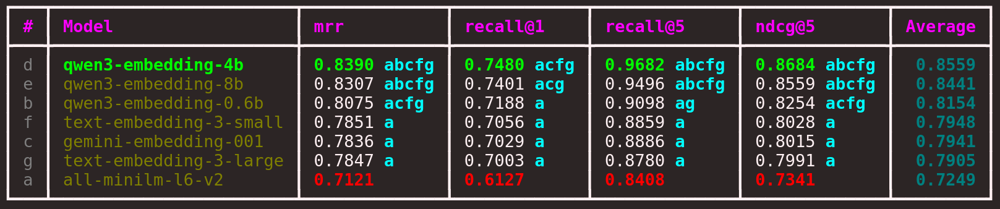

# Benchmarking embedding models

Welcome to the repository! This project is designed to help you create a high-quality (golden) dataset from your own or your company's data. After that, you will use that dataset to benchmark and compare different embedding models.

You will evaluate the models using various metrics, including [MRR](https://amenra.github.io/ranx/metrics/#mean-reciprocal-rank), [Recall@K](https://amenra.github.io/ranx/metrics/#recall), and [NDCG@K](https://amenra.github.io/ranx/metrics/#ndcg). Additionally, you will apply [statistical tests](https://en.wikipedia.org/wiki/Statistical_hypothesis_test) to determine whether the differences between models are statistically significant.

By combining these metrics and tests, you can confidently identify the best embedding model for your specific use case. Below is an example comparison of seven models on a custom dataset:

*Figure 1: Comparison of seven embedding models on a custom dataset.*
