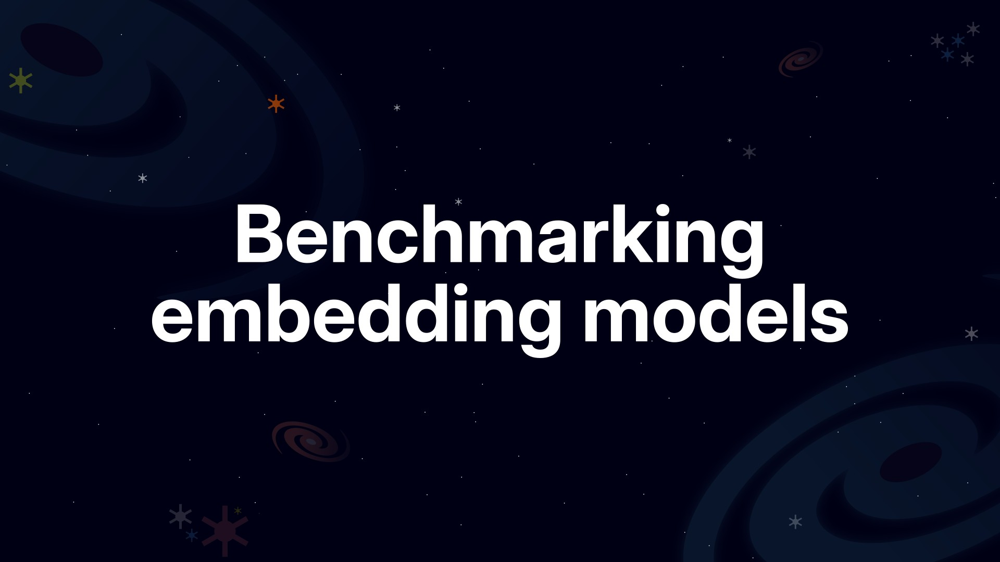

# Benchmarking embedding models



Welcome to the repository! This project is designed to help you create a high-quality (golden) dataset from your own or your company's data. After that, you will use that dataset to benchmark and compare different embedding models.

You will evaluate the models using various metrics, including [MRR](https://amenra.github.io/ranx/metrics/#mean-reciprocal-rank), [Recall@K](https://amenra.github.io/ranx/metrics/#recall), and [NDCG@K](https://amenra.github.io/ranx/metrics/#ndcg). Additionally, you will apply [statistical tests](https://en.wikipedia.org/wiki/Statistical_hypothesis_test) to determine whether the differences between models are statistically significant.

By combining these metrics and tests, you can confidently identify the best embedding model for your specific use case. Below is an example comparison of seven models on a custom dataset:


*Figure 1: Comparison of seven embedding models on a custom dataset.*

## What is in this repository?

- `notebooks/`: Jupyter notebooks for each step in the pipeline.
- `slides/`: Presentation slides used in the YouTube series.
- `data/`: Data used in the notebooks.

> [!NOTE]
> The `embedding` folder is not pushed to the repository due to its large size. I moved that data into Hugging Face, [download the files from this repository](https://huggingface.co/datasets/ImadSaddik/BenchmarkEmbeddingModelsCourse). After downloading, create an `embedding` folder inside `data/` and put the JSON files there.

## What you will learn?

The notebooks in this repository follow exactly this pipeline:


The pipeline is structured in a way that makes it easy to follow and understand each step. You will learn the following concepts:

- The limitations of extracting text from PDF files with Python libraries and to solve that with the help of VLMs (Vision Language Models).
- How to divide the extracted text into chunks that preserve context.
- Generation questions for each chunk using LLMs (Large Language Models).
- Use embedding models to create vector representations of the chunks and questions.
- Use both open source and proprietary embedding models.
- Use [llama.cpp](https://github.com/ggml-org/llama.cpp) to run models in the GGUF format locally on your machine.
- Perform the benchmarking of different embedding models using various metrics and statistical tests with the help of [ranx](https://github.com/AmenRa/ranx).
- Plot the vector representations to visualize if clusters are being formed.
- Understand how to interpret the p-value that a statistical test provides.
- And much more!

## Setup

To get started, install [Python](https://www.python.org/downloads/) and create a virtual environment.

```bash
# Anaconda
conda create -n benchmark-embedding-models python=3.13 -y
conda activate benchmark-embedding-models

# venv
python -m venv benchmark-embedding-models
source benchmark-embedding-models/bin/activate  # On Windows use `benchmark-embedding-models\Scripts\activate`
```

Now, install the required dependencies:

```bash
pip install -r requirements.txt
```
